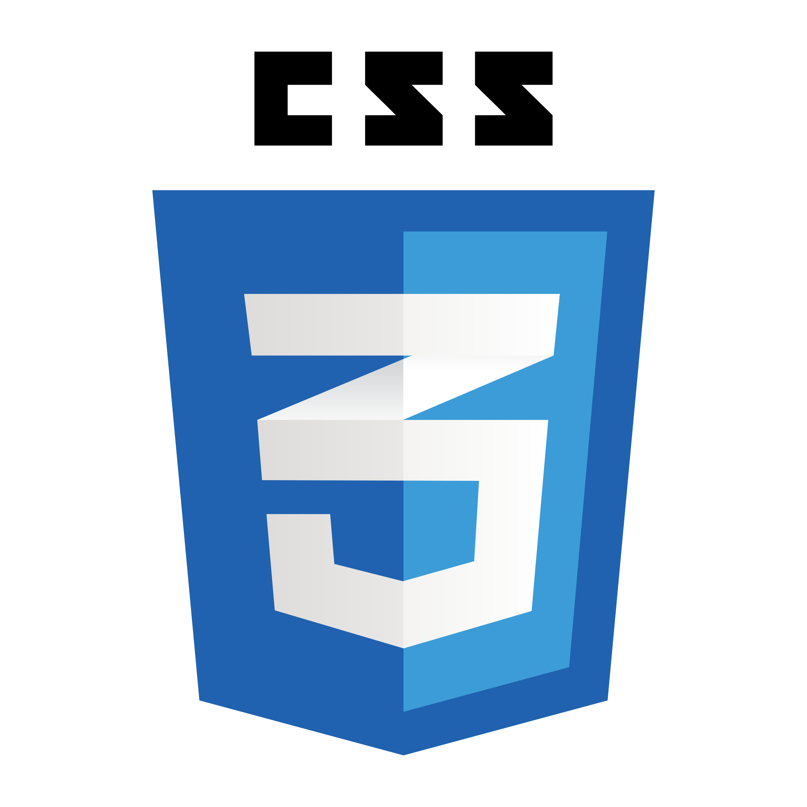
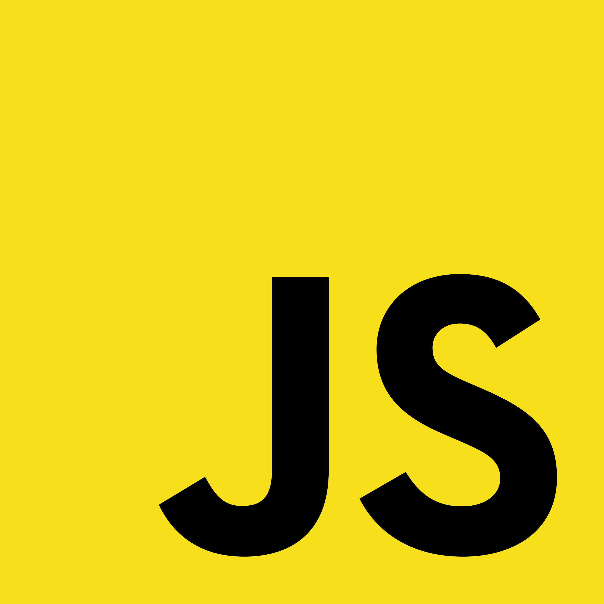

# Hello! I'm Keishi
I'm a self-taught developer 
I do coding in my spare time, as I have school

# About Me
<h2>Skills</h2>

  

<h2>More About Me</h2>
<li>I speak: English / Traditional Chinese / Simplified Chinese / Japanese</li>
<li>A Developer that makes random stuff</li>
<li>An Artist with Lack of Ideas</li>
